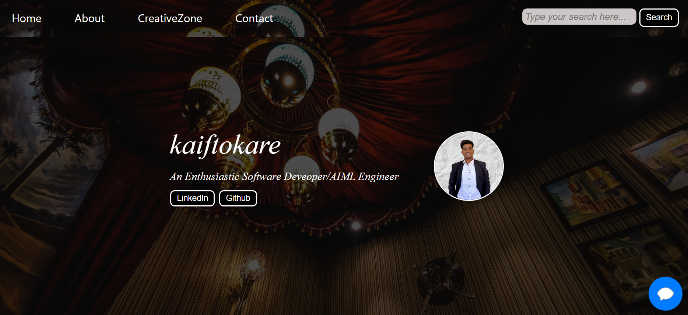

# 🚀 Portfolio Website

Welcome to my *Portfolio Website!* This website serves as a comprehensive representation of my *resume, skills, achievements, and personal interests. It is built using **HTML, CSS, and JavaScript* and features an interactive chatbot that responds based on a predefined JSON file.

## 🔗 Live Demo
[Click here to Checkout my Portfolio](https://kaiftokare19.github.io/Portfolio-Website/)

---

## 🎯 Features
- *Multi-Page Navigation:* The website consists of four main pages - *Home, About, CreativeZone, and Contact*.
- *Functional Chatbot:* The chatbot interacts with users based on the data fed into its JSON file.
- *Dynamic Search Bar:* A search functionality in the navbar redirects users to *Google search results*.
- *3D Animated Cube:* Showcasing *my interests interactively*.
- *Achievements Showcase:* Highlights *my professional and personal accomplishments*.
- *Star Projects:* A dedicated section to display and update my *best projects*.
- *CreativeZone Section:* Featuring my *YouTube journey and travel experiences*.
- *Contact Form:* Users can connect with me via a form (*currently not functional but will be in future versions*).

---

## 📌 Pages Overview

### 🔹 1. Home Page
- General insights into *Engineering*
- Overview of *Technical and Soft Skills*
- Display of *Achievements and Selected Images*
- A *3D Animated Cube* rotating with my interests

### 🔹 2. About Page
- My passion for *Video Editing* and areas of enthusiasm
- Section featuring my *Star Projects* (Updated regularly)

### 🔹 3. CreativeZone Page
- Showcasing my *YouTube journey*
- Sharing my passion for *Traveling*

### 🔹 4. Contact Page
- *Social Media Links* for easy connection
- A *Contact Form* (to be made functional in future versions)

---

## 🔮 Future Enhancements
- *Make the Contact Form Functional* to allow direct communication.
- *Enhance Chatbot Capabilities* for improved user experience.
- *Add More Interactive Elements* to engage visitors.

---

## 📬 Connect With Me
- *LinkedIn:* www.linkedin.com/in/kaif-tokare-877538249
- *GitHub:* www.github.com/Kaiftokare19
- *Email:* kaiftokare19@gmail.com

---

### 🎉 Thank you for visiting my portfolio! 🚀
